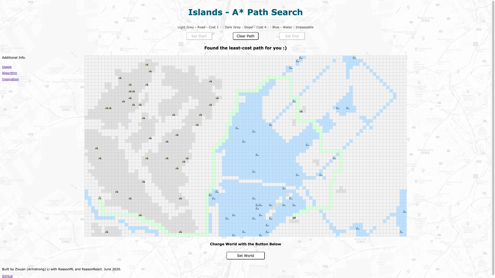
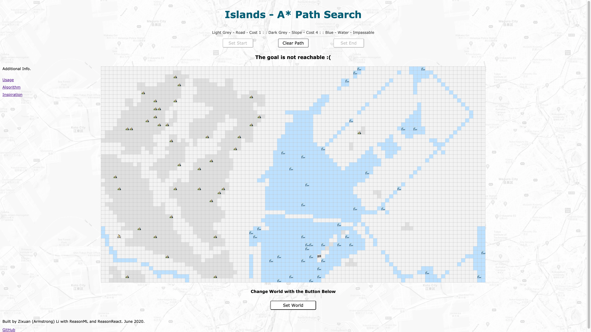
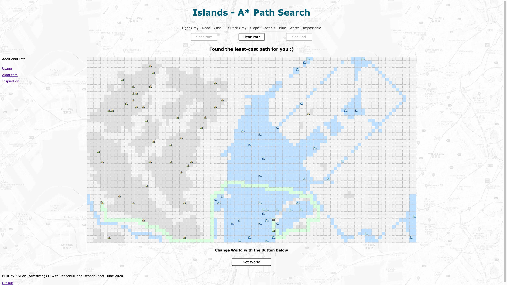
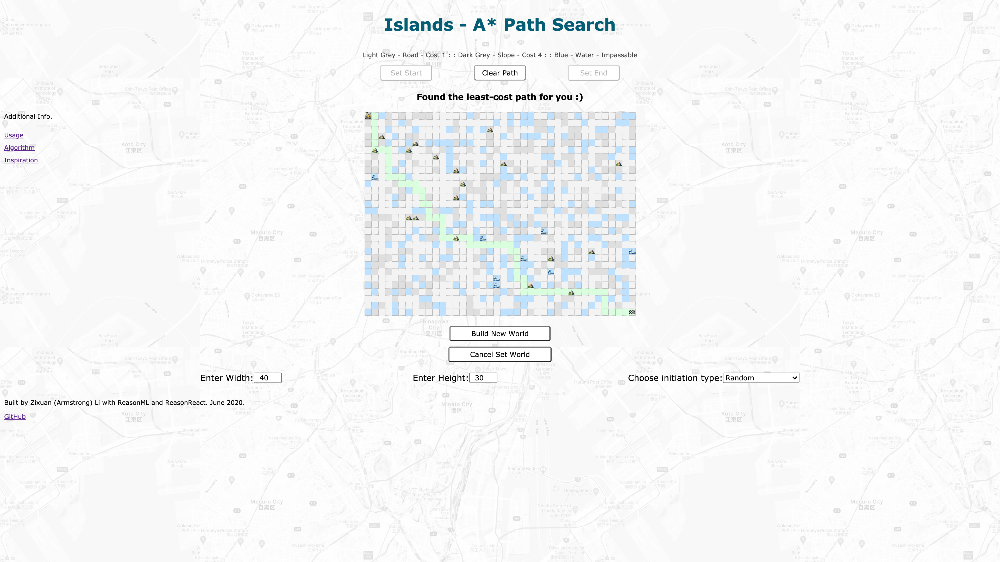
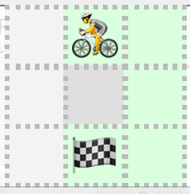

# Islands 🚴⛰🌊🏁

## Introduction

Islands is a shortest (or minimun cost) path finder in 2D grid. 

There are three types of element in the grid.
- Road, light gray. Cost 1
- Slope/Hill/Mountain, darker gray (occasionally ⛰). Cost 4
- Water, blue (occasionally 🌊) . Impassable

Start is labeld as 🚴 (on Road) or 🚵 (on Mountain). End is labeled as 🏁 (couldn't find a good emoji for flag on mountain)

Valid directions are up, left, right, down. No diagnoal moving.

`Find Path` founds the path from start to end that minimizes the cost. Path is shown in light green. If there's no path, nothing is shown.

Each element in the grid could be toggled when clicking on it, provided that `Find Path` is not enabled. `Clear path` before edit the grid if necessary.

`Set Start` and `Set End` enables setting of the start and the end by click on a non-water element.

`Set World` enables setting of the grid. A minimun of 3 X 3 and a maximum of 96 X 54 grid are allowed. Possible type of grid initiation are Blank (all road), Random and Tokyo Bay (initial). If you wonder why it's called Tokyo Bay, it's my best attempt to reproduce contour of Tokyo Bay on a 2D grid.  [Take a look on Google Map](https://www.google.com/maps/@35.6438476,139.7549966,13.81z) More on why I choose Tokyo Bay in [inspiration section](https://github.com/Ironaki/Islands#inspiration).


## File Description

```
src
├── App.re         # App, introduction info & external links
├── AStar.re       # A* implemetation
├── Grid.re        # Module for grid, controls path search, start/end setting, grid construction
├── Index.re       # Index
├── SharedType.re  # Shared types and utility functions
├── TokyoBay.re    # Initial grid data for Tokyo Bay presentation in 2D grid
├── Unit.re        # Module for element in grid, controls change between element type
└── World.re       # Module for taking grid size and initiation type input
```

## Demo

- Found path


- Cannot find path


- If we can bike across Rainbow Bridge


- Random world


## Run Project

``` sh
yarn install
yarn start
# in another tab
yarn run server
```


```sh
# Or with npm
npm install
npm start
# in another tab
npm run server
```

View Islands in the browser at http://localhost:8000

Running in this environment provides hot reloading and support for routing; just edit and save the file and the browser will automatically refresh. To use a port other than 8000 set the `PORT` environment variable (`PORT=8080 npm run server`).


## Algorithm

[A* algorithm](https://en.wikipedia.org/wiki/A*_search_algorithm), Manhattan distance used for heuristic. The more well-known Dijkstra's algorithm is special case of A* with 0 heuristic.

## Inspiration

When the project is first conceived, I planed to build a shortest path finder for a boat to travel between islands. This is a boring scenario. If all elements in the grid have the same cost for traversing, then BFS (breadth first search) will be adequate, although Dijkstra's and A* will still be faster.

A new scenario is for a person on bike to find an easy path. As a casual cyclist myself, maybe too casual to even be called a cyclist :) , I'm quite averse to slopes. One of my favorite route in Tokyo travels around some man-made islands, (Odaiba, Ariake, Toyosu, to name a few). Roads are good, and traffic is little on these islands. This is the reason that I still name this project Islands. 

Living in southern Tokyo, to get to these islands, I need to travel across Minato ward, which is famous for it's slopes. Here's Minato-ku's website: [A lot of the places are named Saka 坂 (slope) in Minato](https://www.city.minato.tokyo.jp/kyouikucenter/kodomo/kids/machinami/saka/index.html). To avoid these slopes, I usually ride east first, and travel along the coast north to Tsukiji or Ginza, then go to the islands. The shortest path for the initial state in the grid reflects this route. (BTW, You cannot bike across the Rainbow Bridge, thus it's impassable in the initial grid. Technically you can walk your bike across it, but that's not really interesting.)

Why is the cost of slope 4? In a 3 X 3 grid, if there's a slope in the middle, I'm the kind of person who would take the detour. If cost of slope is 3, then traveling through the slope would make no difference.


